# Axiom - No-Code AI Agent Platform for Injective

## Overview
Axiom is a no-code platform that enables users to design, deploy, and manage AI agents on the Injective blockchain using iAgent. The platform features a user-friendly interface for defining agent behaviors, AI-assisted design, and a marketplace for sharing and selling agent designs, ensuring security and compliance.

## Architecture Diagram




## Key Features
- **User-Friendly Interface**: Drag-and-drop tools and natural language input for describing agent behaviors
- **AI-Assisted Design**: Generate agent configurations from user descriptions with AI assistance
- **Agent Deployment**: Seamless integration with iAgent for blockchain deployment
- **Marketplace**: Buy, sell, and share agent designs with secure smart contract transactions

## Project Structure
- `frontend/`: React-based web application for the no-code interface
- `backend/`: Node.js server for handling AI processing and blockchain interactions
- `contracts/`: CosmWasm smart contracts for the agent marketplace
- `docs/`: Documentation for the platform
- `iAgent/`: Python-based AI agent framework for Injective

## Getting Started
1. Clone this repository
2. Install dependencies for both frontend and backend
3. Set up environment variables
4. Set up iAgent (see [iAgent Setup Guide](docs/iagent-setup.md))
5. Run the development servers

## Development Setup
```bash
# Install frontend dependencies
cd frontend
npm install

# Install backend dependencies
cd ../backend
npm install

# Run frontend development server
cd ../frontend
npm run dev

# Run backend development server
cd ../backend
npm run dev
```

## Documentation

The platform includes comprehensive documentation available both in-app and in the docs directory:

### User Guide
The platform includes comprehensive documentation for users:

- **Getting Started**: Access via the Axiom app navigation or see the user guides in `docs/user-guide/`
- **Creating an Agent**: Available in the in-app guides
- **Deploying an Agent**: Detailed in the platform interface
- **Using the Marketplace**: Covered in the application

### Developer Guide
For developers looking to extend or contribute to the platform:

- **Access the Developer Guide**: Visit `/developer-guide` in the Axiom application
- **Architecture Overview**: [docs/developer-guide/architecture.md](docs/developer-guide/architecture.md)
- **Frontend Development**: [docs/developer-guide/frontend.md](docs/developer-guide/frontend.md)
- **Backend Development**: [docs/developer-guide/backend.md](docs/developer-guide/backend.md)
- **Smart Contract Integration**: [docs/developer-guide/smart-contract-integration.md](docs/developer-guide/smart-contract-integration.md)

### API Reference
Detailed API documentation is available both in-app and in the docs directory:

- **Access the API Reference**: Visit `/api-reference` in the Axiom application
- **Authentication**: [docs/api-reference/authentication.md](docs/api-reference/authentication.md)
- **Agent API**: [docs/api-reference/agent-api.md](docs/api-reference/agent-api.md)
- **Deployment API**: [docs/api-reference/deployment-api.md](docs/api-reference/deployment-api.md)
- **Marketplace API**: [docs/api-reference/marketplace-api.md](docs/api-reference/marketplace-api.md)

All documentation is also integrated directly into the application for a seamless experience.

## iAgent Integration
This project integrates with iAgent, a Python-based AI agent framework developed by Injective Labs. iAgent allows you to create and manage AI agents that can interact with the Injective blockchain.

### Setting up iAgent
```bash
# Clone the iAgent repository
git clone https://github.com/InjectiveLabs/iAgent.git
cd iAgent

# Install the required Python packages
pip install -r requirements.txt

# Set up your OpenAI API key
export OPENAI_API_KEY="your_openai_api_key_here"

# Start the iAgent server
python agent_server.py --port 5000
```

For more detailed instructions, see the [iAgent Setup Guide](docs/iagent-setup.md).

## Technologies Used
- **Frontend**: React, TypeScript, Chakra UI, Tailwind CSS
- **Backend**: Node.js, Express
- **Blockchain**: Injective, CosmWasm
- **AI**: OpenAI API for agent configuration generation
- **iAgent**: Python-based AI agent framework for Injective

## Troubleshooting
If you encounter issues:

1. Make sure all dependencies are installed
2. Check that environment variables are set correctly
3. Verify that the iAgent server is running (if using iAgent features)
4. Check the console for error messages

## Contributing
We welcome contributions to the Axiom platform! Please see our [Contributing Guide](CONTRIBUTING.md) for more information.

## License
This project is licensed under the MIT License - see the [LICENSE](LICENSE) file for details.

## Hackathon Information
This project is being developed for the [Injective AI Hackathon](https://dorahacks.io/hackathon/injective-ai/). 